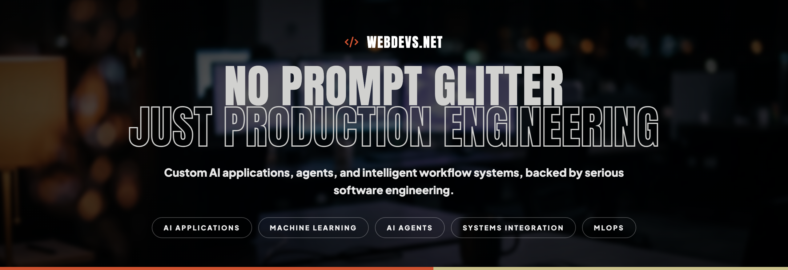
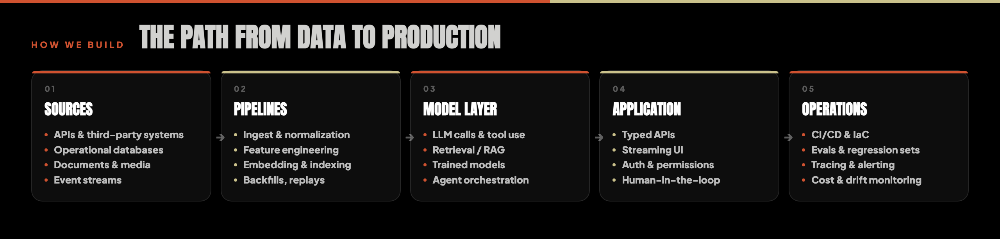
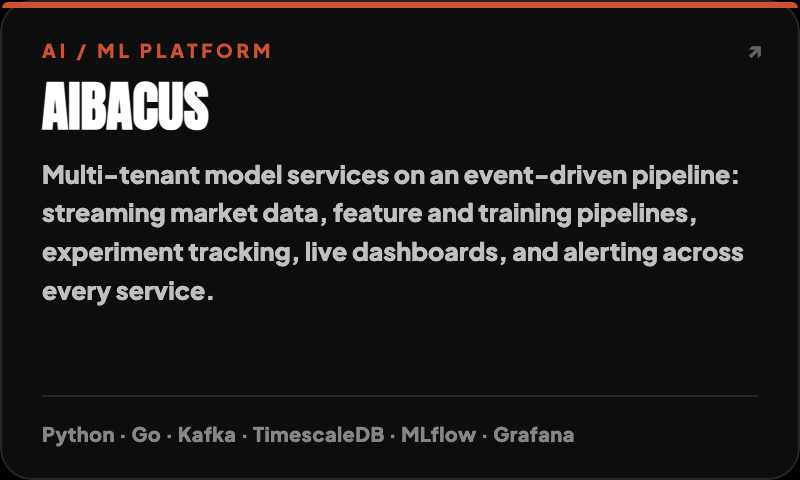
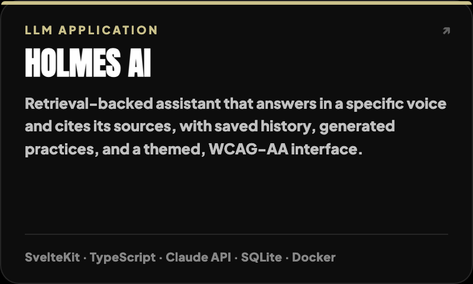
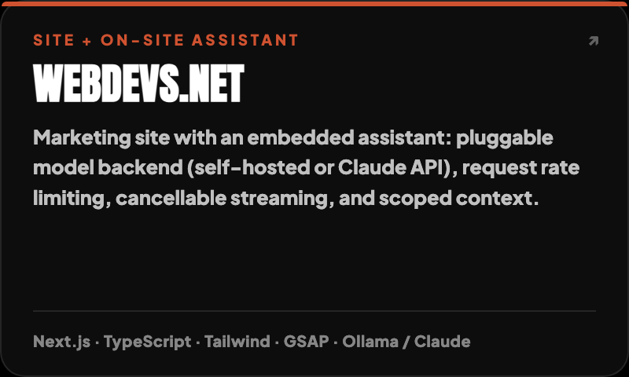
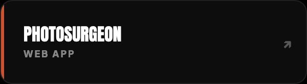
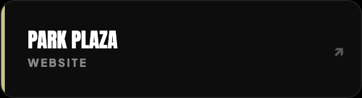
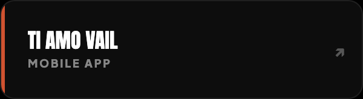
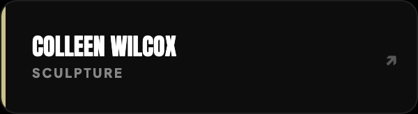

---

## What this organization is

Web Devs is a security-focused engineering team building AI-backed applications and the systems around them:
data pipelines, model integration, APIs, interfaces, and the CI/CD and monitoring that keep all of
it running. Most repositories here are private client codebases, one repo per site or platform,
each with its own environment config and deploy path.

The tagline on the banner is a working principle, not a slogan: a demo that calls an API is not a
system. The engineering is in everything around the model: schema and data quality, retrieval
correctness, permissions, failure modes, cost ceilings, and the evals that tell you when output
quality regressed.

---

## Engineering focus

| Area | What that means in practice |
|---|---|
| **Custom AI apps** | Chat and copilot surfaces, RAG over private corpora, structured extraction with schema validation, multi-step agent workflows with tool allowlists, retry/timeout policy, and per-request cost ceilings. |
| **Machine learning** | Feature engineering, training and evaluation pipelines, walk-forward/holdout validation rather than pooled fits, deployment behind versioned interfaces, and drift monitoring after release. |
| **Workflow automation** | Document and invoice processing, support triage, and content operations, all queue-backed, idempotent and replayable, with human review gates where a wrong answer is expensive. |
| **Web and application development** | TypeScript front ends (React/Next.js, Svelte), server-rendered and streaming UI, typed API boundaries, auth and role-based permissions, accessibility and Core Web Vitals as build criteria. |
| **Data engineering** | Ingest and normalization, time-series and relational modeling, backfills and gap detection, retention and archival policy, restore-tested backups. |
| **DevOps / MLOps** | Dockerized local and production parity, CI/CD, infrastructure as code, log/metric/trace collection, alerting, and model and pipeline monitoring. |

---

## Stack

**AI & machine learning**

**Frontend**

**Backend & data**

**Infrastructure & MLOps**

---

---

## How we work

- **Environment parity.** Local development runs in Docker against the same images and service
  topology as production; config comes from environment files, never from committed secrets.
- **Reviewed changes.** Feature branches and pull requests, with review before merge to `main`.
  Migrations are explicit, ordered, and paired with a rollback path.
- **Verified before "done".** Changes are checked against a running instance (logs, network,
  rendered output) rather than declared complete on a clean build. A green build is not evidence
  that a page renders.
- **Evals for AI features.** Prompt and model changes are measured against a fixed regression set,
  with cost and latency tracked alongside output quality. No shipping on vibes.
- **Observability by default.** Structured logs, metrics, and alerting from day one, plus tracing
  for multi-step and agent workflows so failures are attributable to a step, not to "the AI".
- **Data hygiene.** Schema constraints, gap detection, and restore-tested backups. Backups that
  have never been restored are not backups.
- **Documented handoff.** Runbooks and READMEs live in the repo so operations do not depend on one
  person's memory.

---

## Security

Security is part of the build, not a pass at the end.

- **Least privilege.** Credentials are managed outside the codebase, and access is granted per
  engagement and revoked when it ends.
- **Untrusted input at every boundary.** Validation on inbound data, and model output and retrieved
  documents treated as untrusted too, with prompt injection assumed by default.
- **Maintained, not just launched.** Dependency and platform patching on a schedule, edge
  protection for public sites, and a documented response path when something does get through.

---

## Selected work

Every card links to the live system.

**AI systems and platforms**

**Web and app work**

Aibacus and Holmes AI are platforms we build and operate; the web and app work is client delivery.
Case studies and screenshots: [webdevs.net/portfolio](https://webdevs.net/portfolio)

---

## Repository conventions

Anyone working in this org can expect the same shape across repos:

| | |
|---|---|
| `README.md` | What the project is, how to run it locally, how it deploys |
| `docker-compose*.yml` / `Dockerfile` | Local and production containers; local mirrors production |
| `.env.example` | Every required variable, documented, with no real values |
| `deploy.sh` / CI workflow | The one supported deploy path for that project |
| `docs/` | Architecture notes, runbooks, and migration/incident history where they exist |

Client repositories are private, and access is granted per engagement. Public repos here are the
exception rather than the rule.

---

## Contact

Technical inquiries welcome. California, USA.

[_772--9972-1a1a1a?style=for-the-badge&logo=telegraph&logoColor=cf5230)](tel:+17207729972)

